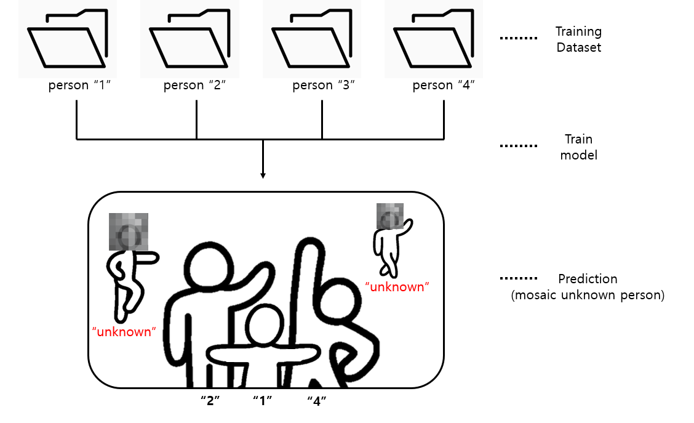

# Face_detection_and_mosaic
> SNS나 1인 미디어에서 사진을 업로드할 때, 배경에 의도치 않게 등장한 낯선 사람의 얼굴을 자동으로 식별하고 모자이크해주는 AI 프로그램
>  나도 모르게 타인의 초상권을 침해할 수 있는 일을 방지
# Results
 
> 아이유, 김수현, 윤아 3명의 사람을 학습시킨 결과
>   대부분의 얼굴을 잘 식별해서 **"학습되지 않은"** 인물들의 얼굴만 모자이크(블러) 처리
# Process
 
> 각 object에 대한 training data는 **한 장씩**만 있어도 좋은 성능을 보임
>   SNS에 개개인의 학습데이터(사진)가 많이 올라와있지 않아도 업로드할 때 잘 인식할 수 있음
>   많은 반복학습을 필요로 하지 않아서 빠른 속도
# Requirements
~~~
pip install tensorflow face_recognition opencv-python matplotlib scikit-learn
~~~
