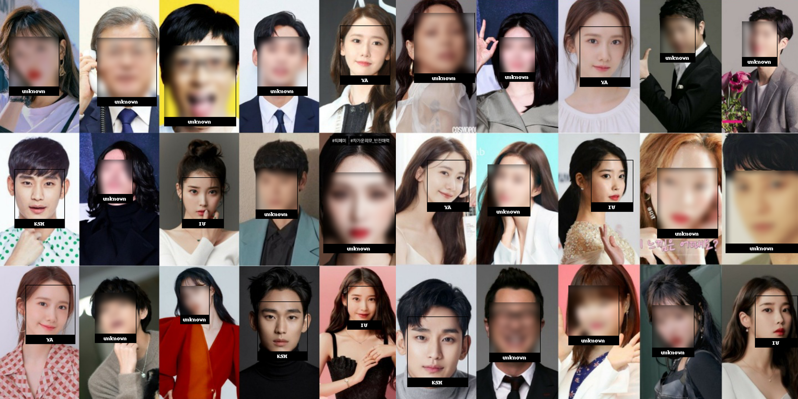

# Face_detection_and_mosaic
> SNS나 1인 미디에서 사진을 업로드할 때, 배경에 의도치 않게 등장한 낯선 사람의 얼굴을 자동으로 식별하고 모자이크해주는 AI 프로그램
>  나도 모르게 타인의 초상권을 침해할 수 있는 일을 방지
 
# Results

> 아이유, 김수현, 윤아 3명의 사람을 학습시킨 결과
>   대부분의 얼굴을 잘 식별해서 *"학습되지 않은"* 인물들의 얼굴만 모자이크처리한 것을 볼 수 있다.
# Process

